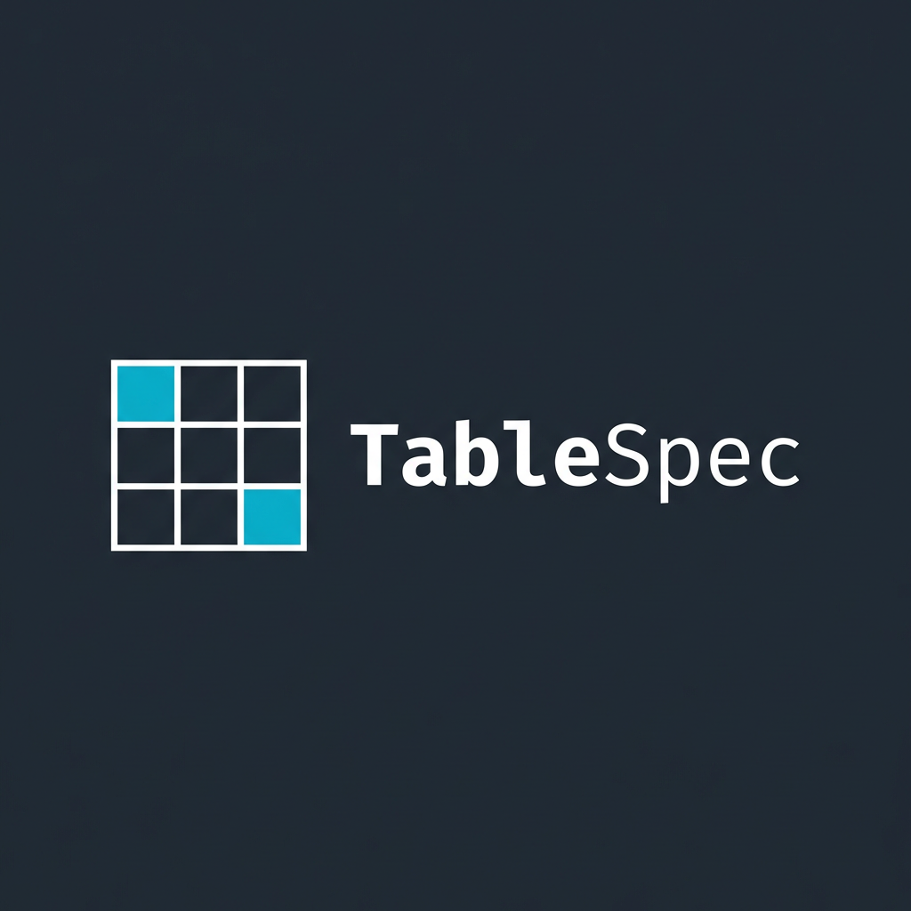

<div align="center">

# TableSpec

**DDL SQL to Table Specification & ERD Generator**

SQL DDL 파일을 업로드하면 테이블 명세서와 ERD를 자동으로 생성합니다.

[](https://table-spec.com)
[](LICENSE)

[Live Demo](https://table-spec.com) · [Report Bug](https://github.com/pinomaker/table-spec/issues)

<br/>



</div>

---

## Overview

**TableSpec**은 DDL(Data Definition Language) SQL 파일을 분석하여 다음을 자동으로 생성하는 웹 애플리케이션입니다:

- **테이블 명세서** — 컬럼명, 데이터 타입, 제약 조건, 기본값 등을 한눈에 확인
- **ERD (Entity-Relationship Diagram)** — 테이블 간 관계를 시각적으로 표현
- **Excel 다운로드** — 명세서를 서식이 적용된 `.xlsx` 파일로 내보내기

## Features

| 기능 | 설명 |
|------|------|
| DDL 파싱 | `CREATE TABLE` 문에서 컬럼, PK, FK, UNIQUE, DEFAULT, AUTO_INCREMENT 등 자동 추출 |
| 테이블 명세서 | 파싱 결과를 깔끔한 테이블 UI로 표시 |
| ERD 생성 | SVG 기반 ERD 자동 레이아웃 및 렌더링 |
| Excel 내보내기 | 스타일이 적용된 `.xlsx` 파일 다운로드 |
| ERD 내보내기 | ERD를 이미지로 다운로드 |
| 드래그 앤 드롭 | `.sql` 파일을 드래그하여 간편하게 업로드 |

## Tech Stack

| Category | Technology |
|----------|-----------|
| Framework | React 19 |
| Language | TypeScript 5.8 |
| Build Tool | Vite 6 |
| Styling | Tailwind CSS 4 |
| Excel | xlsx-js-style |
| Hosting | Netlify |

## Getting Started

### Prerequisites

- Node.js 20+
- pnpm (권장) 또는 npm

### Installation

```bash
# 저장소 클론
git clone https://github.com/pinomaker/table-spec.git
cd table-spec

# 의존성 설치
pnpm install

# 개발 서버 실행
pnpm dev
```

개발 서버가 `http://localhost:5173`에서 실행됩니다.

### Build

```bash
pnpm build
```

빌드 결과물은 `dist/` 디렉토리에 생성됩니다.

## Project Structure

```
src/
├── components/          # React UI 컴포넌트
│   ├── FileUpload.tsx       # 파일 업로드 (드래그 앤 드롭)
│   ├── TablePreview.tsx     # 테이블 명세서 미리보기
│   ├── ERDPreview.tsx       # ERD 미리보기
│   ├── DownloadButton.tsx   # Excel 다운로드 버튼
│   └── ERDDownloadButton.tsx # ERD 다운로드 버튼
├── parser/
│   └── ddlParser.ts         # SQL DDL 파서
├── types/
│   ├── ddl.ts               # DDL 타입 정의
│   └── erd.ts               # ERD 타입 정의
├── excel/
│   ├── excelGenerator.ts    # Excel 생성
│   └── styles.ts            # Excel 스타일
├── erd/
│   ├── erdGenerator.ts      # ERD 데이터 생성
│   ├── erdRenderer.ts       # SVG 렌더링
│   ├── erdLayout.ts         # 레이아웃 계산
│   └── erdColors.ts         # 색상 설정
├── hooks/
│   ├── useDDLParser.ts      # DDL 파싱 훅
│   └── useFileUpload.ts     # 파일 업로드 훅
├── App.tsx                  # 메인 앱 컴포넌트
└── main.tsx                 # 엔트리 포인트
```

## Usage

1. [table-spec.com](https://table-spec.com)에 접속합니다
2. DDL SQL 파일(`.sql`)을 드래그 앤 드롭하거나 클릭하여 업로드합니다
3. 파싱된 테이블 명세서와 ERD를 확인합니다
4. 필요시 Excel 또는 ERD 이미지를 다운로드합니다

### 지원하는 DDL 문법

```sql
CREATE TABLE users (
    id          BIGINT       PRIMARY KEY AUTO_INCREMENT,
    email       VARCHAR(255) NOT NULL UNIQUE,
    name        VARCHAR(100) NOT NULL,
    created_at  TIMESTAMP    DEFAULT CURRENT_TIMESTAMP,
    FOREIGN KEY (dept_id) REFERENCES departments(id)
);
```

## License

This project is licensed under the MIT License.

---

<div align="center">

Made with ❤️ by [pinomaker](https://github.com/pinomaker)

</div>